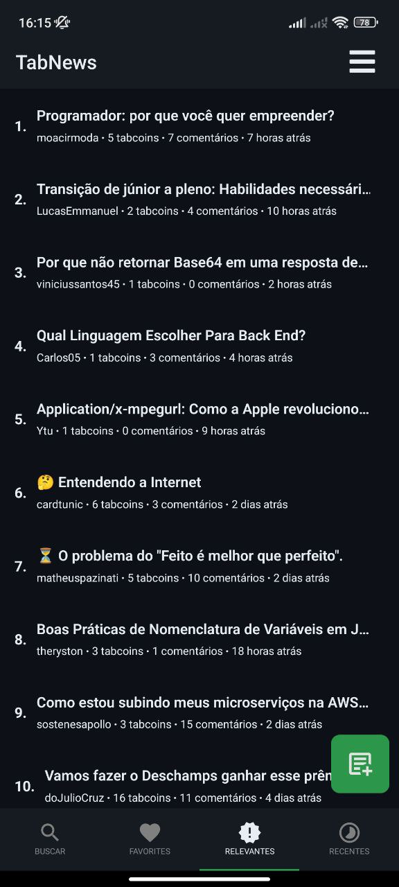
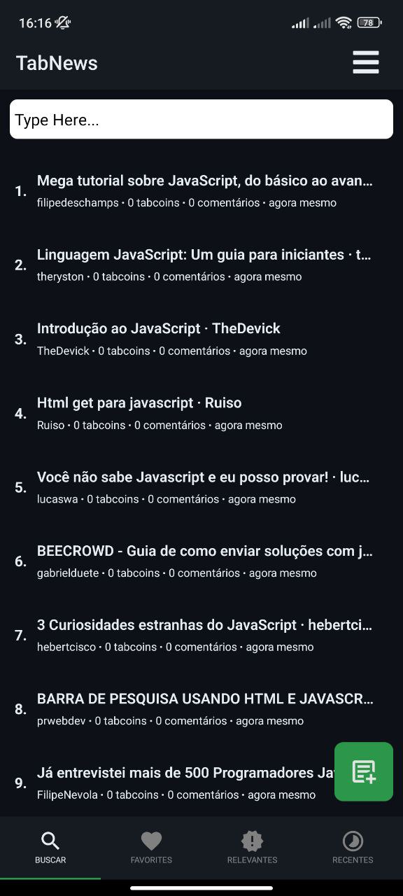
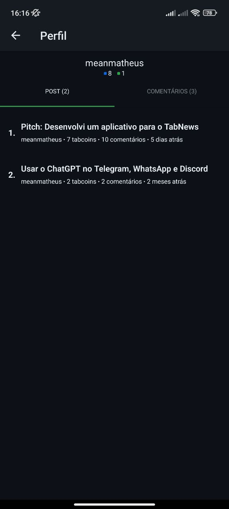
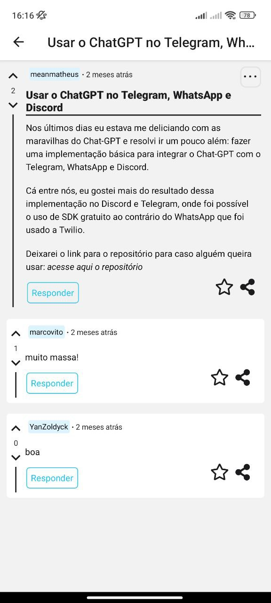

<a id="readme-top"></a>

[![Contributors][contributors-shield]][contributors-url]
[![Forks][forks-shield]][forks-url]
[![Stargazers][stars-shield]][stars-url]
[![Issues][issues-shield]][issues-url]
[![MIT License][license-shield]][license-url]

<!-- PROJECT LOGO -->
<br />
<div align="center">
  <a href="https://github.com/matheuswr89/tabnews-app">
    
  </a>

  <p align="center">
    <a href="https://github.com/matheuswr89/tabnews-app/issues">Report Bug</a>
    ·
    <a href="https://github.com/matheuswr89/tabnews-app/issues">Request Feature</a>
  </p>
</div>

<!-- TABLE OF CONTENTS -->
<details>
  <summary>Sumário</summary>
  <ol>
    <li>
      <a href="#sobre-o-projeto">Sobre o Projeto</a>
      <ul>
        <li><a href="#tecnologias-utilizadas">Tecnologias utilizadas</a></li>
      </ul>
    </li>
    <li>
      <a href="#configuração">Configuração</a>
      <ul>
        <li><a href="#pré-requisitos">Pré-requisitos</a></li>
        <li><a href="#instalação">Instalação</a></li>
      </ul>
    </li>
    <li><a href="#uso">Uso</a></li>
    <!-- <li><a href="#contact">Contato</a></li> -->
  </ol>
</details>

<!-- ABOUT THE PROJECT -->

## Sobre o Projeto

Aplicativo desenvolvido para facilitar o acesso ao site [TabNews](www.tabnews.com.br/) de forma fácil e intuitiva.

[Download do aplicativo](https://github.com/matheuswr89/tabnews-app/raw/master/android/app/release/app-release.apk)

<p align="right">(<a href="#readme-top">Voltar para o início</a>)</p>

## Prints

| Tela       | Dark mode                                            | White Mode                                            |
| :--------- | :--------------------------------------------------- | :---------------------------------------------------- |
| Revelantes |  |  |
| Search     |      |      |
| User       |        |        |
| Post       |          |          |

### Tecnologias utilizadas

- [React Native](https://reactnative.dev/)
- [Android Studio](https://developer.android.com/studio)

<p align="right">(<a href="#readme-top">Voltar para o início</a>)</p>

<!-- GETTING STARTED -->

## Configuração

### Pré-requisitos

- [Android Studio](https://developer.android.com/studio)
- [Node JS](https://nodejs.org/en/)
- [Yarn](https://yarnpkg.com/)

### Instalação

1. Clone o respositório
   ```sh
   git clone https://github.com/matheuswr89/tabnews-app.git
   ```
2. Execute um dos comandos abaixo para instalar as dependencias:
   ```sh
   npm install
   ```
   ou
   ```sh
   yarn
   ```
3. Com o Android Studio instalado crie um emulador seguindo esse passo a passo: [https://developer.android.com/studio/run/managing-avds?hl=pt-br](https://developer.android.com/studio/run/managing-avds?hl=pt-br)

<p align="right">(<a href="#readme-top">Voltar para o início</a>)</p>

<!-- USAGE -->

## Uso

1. Para iniciar a aplicação
   ```sh
     npx expo start
   ```
   <p align="right">(<a href="#readme-top">Voltar para o início</a>)</p>

[contributors-shield]: https://img.shields.io/github/contributors/matheuswr89/tabnews-app.svg?style=for-the-badge
[contributors-url]: https://github.com/matheuswr89/tabnews-app/graphs/contributors
[forks-shield]: https://img.shields.io/github/forks/matheuswr89/tabnews-app.svg?style=for-the-badge
[forks-url]: https://github.com/matheuswr89/tabnews-app/network/members
[stars-shield]: https://img.shields.io/github/stars/matheuswr89/tabnews-app.svg?style=for-the-badge
[stars-url]: https://github.com/matheuswr89/tabnews-app/stargazers
[issues-shield]: https://img.shields.io/github/issues/matheuswr89/tabnews-app.svg?style=for-the-badge
[issues-url]: https://github.com/matheuswr89/tabnews-app/issues
[license-shield]: https://img.shields.io/github/license/matheuswr89/tabnews-app.svg?style=for-the-badge
[license-url]: https://github.com/matheuswr89/tabnews-app/blob/master/LICENSE.txt
